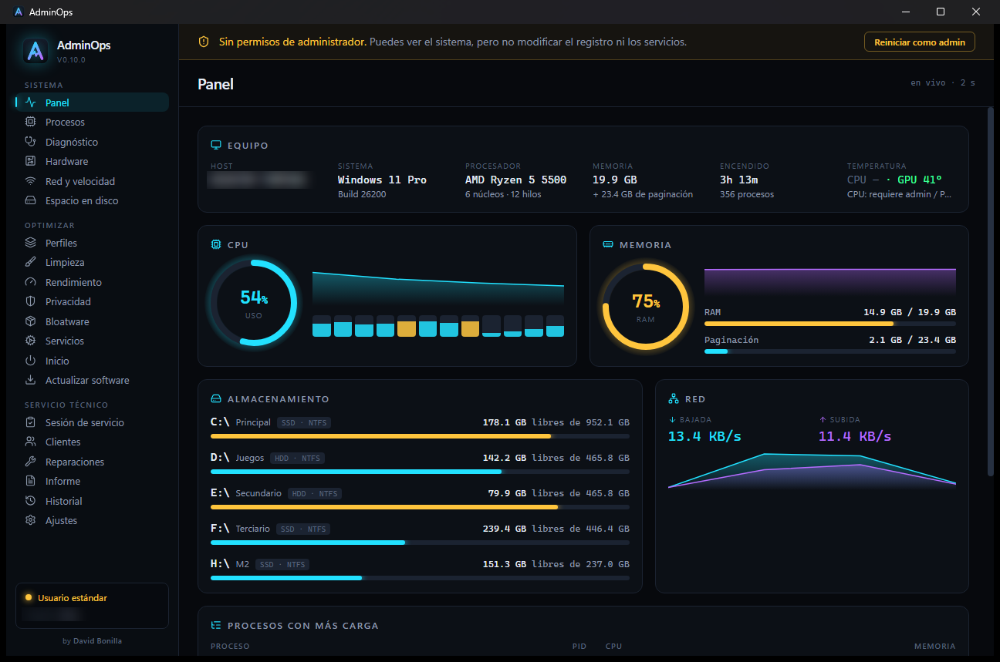
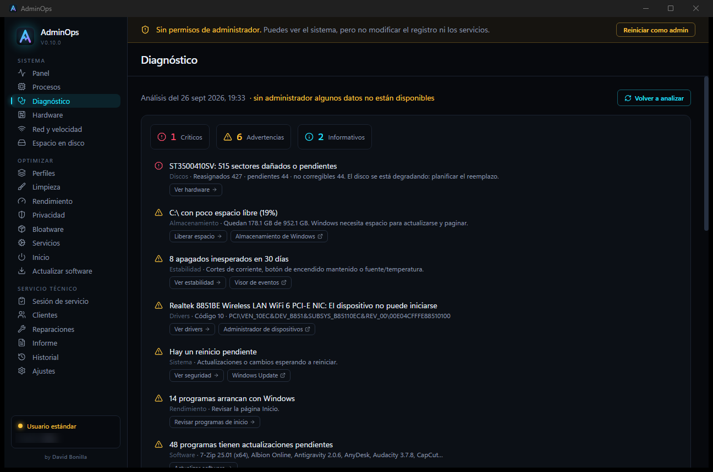
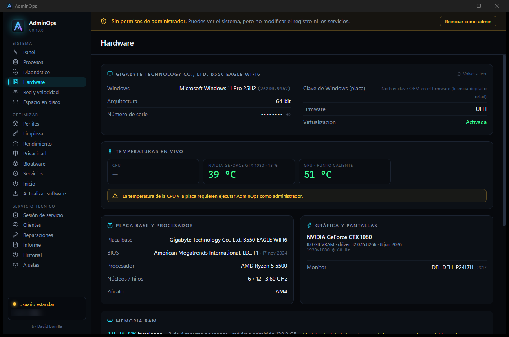
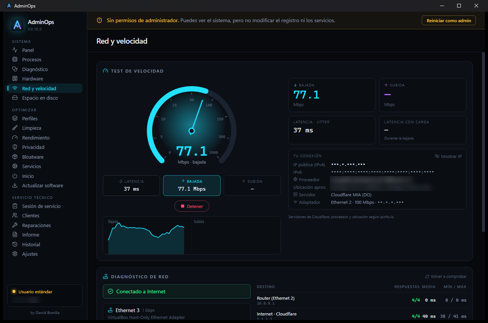
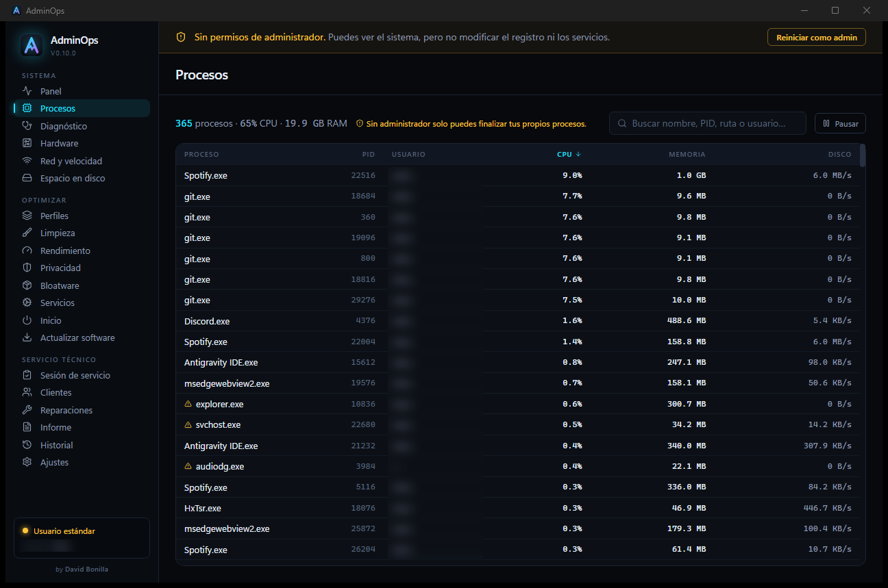
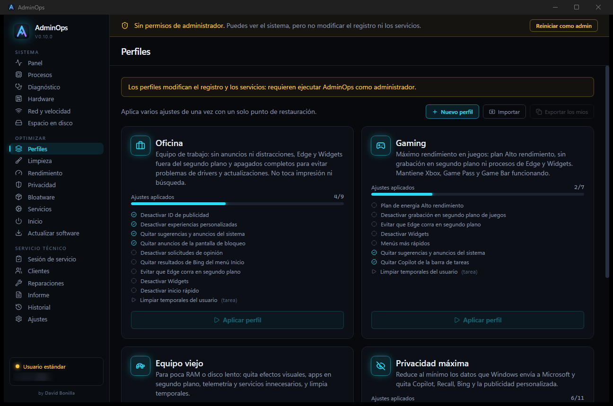

<div align="center">


# AdminOps

**Diagnostics, optimization and tech-support toolkit for Windows 10/11, in a single app.**

[🇪🇸 Español](README.md) · 🇬🇧 **English**

[](https://github.com/XsharklinX/AdminOps/releases)
[](#requirements)
[](docs/DEVELOPMENT.md)
[](https://github.com/XsharklinX/AdminOps/releases/latest)



</div>

---

> [!NOTE]
> The app interface is currently in **Spanish**. An English version is planned (see the [roadmap](ROADMAP.md)).

## What is AdminOps?

AdminOps is a desktop tool built for **tech-support technicians** and power users.
It brings together in one window what usually takes a dozen programs: live system status,
finding what's wrong, applying safe optimizations **that can be undone**, and handing the customer
a professional **PDF report** of the work done.

- ⚡ **Light and fast**: built with Rust + WebView2, starts in seconds and uses little memory.
- 🛟 **Safe**: every change stores the exact previous value and can be undone; risky changes create a restore point first.
- 🔒 **Private**: no accounts, no telemetry. All data stays on the machine.
- 🧳 **Portable**: carry it on a USB stick and use it on every customer's PC without installing anything (no traces left).
- ⌨️ **Fast to use**: `Ctrl+K` finds any page, tool, tweak or repair; pin your favorite sections.

## Features

### 📊 Live dashboard
Per-core CPU, memory, disks, network, temperatures and the top processes, refreshed every 2 seconds.

### 🩺 Diagnostics
A full scan in seconds: disk health (SMART), blue screens and unexpected shutdowns, crashing apps,
faulty drivers, battery, Defender, Windows Update, activation and TPM.
Every finding is prioritized and comes with **a button to fix it**. For blue screens it points to the **likely driver** by analyzing the memory dumps. Scans are saved so you can compare before and after.



### 🛡️ Security
A **0-100 security score** with every point explained and a button to fix it: antivirus, firewall, UAC, BitLocker, SMB1, remote desktop, accounts and outdated high-risk software. Saves the **BitLocker recovery keys** to a USB drive, looks for suspicious items (tasks, services and startup entries typical of malware, hosts file) and lists browser extensions. The score is included in the report, before and after.

### 🖥️ Hardware
Full inventory (motherboard, BIOS, CPU, RAM per module, GPU, disks, monitors), **live sensors**
(temperatures, fans, voltages) via LibreHardwareMonitor, detailed SMART status for every disk, and the Windows Memory Diagnostic result.



### 🌐 Network & speed test
Professional speed test (download, upload, latency and jitter over several parallel connections),
connection details (ISP, public IP with a hide option, server), network diagnostics (adapters, gateway, DNS and connectivity) and **saved Wi-Fi networks with their passwords**.



### 🛰️ Network tools
Live ping and traceroute, one-click DNS change (Cloudflare, Google, Quad9…), open ports per program and a hosts file editor.

### ⚙️ Processes
Live list with CPU, memory and disk usage per process. Search by name, PID, path or user and **end processes**
(or the whole process tree) right from the app. Critical system processes are flagged so you don't close them by mistake.



### 🎛️ Profiles
Apply dozens of tweaks at once: **Office**, **Gaming**, **Old PC** and **Maximum privacy**,
or build your own. One restore point per profile, and it can be undone as a whole or tweak by tweak.



### 🧹 Optimize
| Section | What it does |
| --- | --- |
| **Cleanup** | Temp files, Windows Update cache, recycle bin, thumbnails, logs and more. |
| **Performance** | Power plan, visual effects, indexing, gaming and other settings. |
| **Privacy** | Telemetry, advertising, Copilot, activity history… |
| **Bloatware** | Removes preinstalled apps with a per-app recommendation; Store apps can be reinstalled. |
| **Services** | Disables unnecessary services, with explanations and revert. |
| **Startup** | Controls what runs at boot (same as Task Manager, nothing gets deleted). |
| **Software updates** | Finds outdated programs and updates them with winget. |
| **Install software** | After a clean install: tick Chrome, 7-Zip, VLC, AnyDesk… (or a saved list) and they all install unattended with winget. |
| **Uninstall software** | Silent or guided uninstall, then sends leftover folders to the Recycle Bin. Cleans orphan entries. |
| **Windows Update** | History with every error explained, pause/resume, find pending updates and hide a problematic one. |
| **Disk space** | Shows which folders take the most space, very fast even on large disks. |

### 🧰 Tech support
| Section | What it does |
| --- | --- |
| **Tickets** | Opens your company's ticketing site (intranet, GLPI, osTicket…) inside AdminOps, with the session remembered. |
| **My network & router** | Current network (IP, router, DNS, public IP), the router's admin panel inside AdminOps with its saved, encrypted login, router and Wi-Fi security check, double NAT and a QR code to connect a phone. |
| **Network devices** | Everything on the local network with IP, MAC, vendor and name; label yours and spot new ones. |
| **Vault** | A BitLocker-encrypted, password-protected drive stored in a file that opens with a double click, even without AdminOps. On Windows Home, AES-256 encrypted .zip folders. |
| **Secure delete** | Deletes files beyond recovery, wipes free space and walks you through preparing a PC before selling or donating it. |
| **File recovery** | Recovers deleted files with Microsoft's Windows File Recovery, no command line needed. |
| **Parental control** | Adult and malware web filter, blocked sites and sign-in hours per user. |
| **Domain** | Domain status, pre-checks, join or leave, repair the trust relationship and rename the PC. |
| **Service session** | Logs the work on a PC: initial diagnostics, changes, checklist, quote or receipt and wrap-up with the customer's on-screen signature. |
| **Customers** | Customer records and their PCs, visit history, evolution between visits, active warranties and maintenance reminders. |
| **Tools** | ~90 shortcuts to CMD, services.msc, ncpa.cpl, regedit, Event Viewer, BIOS/UEFI… with search, favorites and your own shortcuts. Includes a copyable PC sheet (serial number and OEM key). |
| **Local users** | Create users, change passwords, make them admin or standard, disable them or delete them along with their profile. Works on Windows Home too. |
| **Data backup** | Copies Desktop, Documents, Pictures, bookmarks and Wi-Fi networks to a USB drive and restores them on the new PC without overwriting anything. |
| **Printers** | Status, paper jams, clear the queue, test page and remove ghost printers. |
| **Repairs** | SFC, DISM, network reset, Windows Update, print spooler, Explorer, time sync, icon cache and RAM test. |
| **Report** | Professional PDF with two templates (customer and technical): PC status, fixed and pending issues, before/after, quote or receipt with taxes, warranties, signatures and email with the PDF attached. |
| **Keyboard shortcuts** | About 150 shortcuts by category (Windows, windows, screenshots, browser, Excel, tech…), a "discover" mode that tells you what the combination you press does, and a button to try them. |
| **History** | Everything that was applied, with undo, plus the technical activity log. |

## Download & install

Get the latest version from **[Releases](https://github.com/XsharklinX/AdminOps/releases/latest)**. Two options:

| File | Use it for |
| --- | --- |
| `AdminOps-x.y.z-Setup.exe` | **Installer**: for your own PC. Detects an existing AdminOps and updates it, keeping your data. |
| `AdminOps-x.y.z-instalador-clasico.exe` | **Classic installer**: the same, with the usual wizard. Supports `/S` for silent installs on many PCs. |
| `AdminOps-x.y.z-portable.zip` | **Portable**: unzip it onto a USB stick. Data is stored next to the executable (`AdminOps-data\`), separated per PC. |

> [!NOTE]
> AdminOps is not code-signed yet, so Windows SmartScreen may show
> *"Windows protected your PC"*. Click **More info → Run anyway**.

### Requirements
- Windows 10 or 11, 64-bit.
- Microsoft Edge WebView2 (already included in Windows 11 and up-to-date Windows 10).
- **Administrator rights** to apply changes. Without them the app runs read-only and offers *Restart as admin*.
- Optional: the **PawnIO** driver to read CPU and motherboard temperatures (the app offers to install it from the Hardware tab).

## How to use it

1. **Run AdminOps as administrator** (or click *Restart as admin* in the top banner).
2. Check the **Dashboard** for an overview of the PC.
3. Run a **Diagnostics** scan and fix the findings with their action buttons.
4. Apply a **Profile** or the tweaks you want under **Optimize**. Everything goes into **History** and can be undone.
5. When working for a customer: open a **Service session**, assign it to the customer and generate the **PDF report** at the end.

> [!TIP]
> Before significant changes, AdminOps creates a Windows restore point automatically.
> If you don't like a change, go to **History** and click *Undo*.

## Privacy

- No accounts, ads or telemetry. Nothing leaves the machine.
- Data (history, customers, reports) is stored locally: `%APPDATA%` with the installer, or `AdminOps-data\` in portable mode.
- External connections only when you ask for them: the speed test (Cloudflare, plus `ipinfo.io` to show the ISP) and software updates (winget).

## Building from source

```bash
npm install
npm run tauri dev        # development mode
npm run build:release    # installer + portable in release/v<version>/
```

Requires Node.js 22+, stable Rust and the Visual Studio C++ build tools.
Architecture, tweak catalog and tests: **[docs/DEVELOPMENT.md](docs/DEVELOPMENT.md)** (Spanish).
Upcoming versions: **[ROADMAP.md](ROADMAP.md)** (Spanish).

## Third-party components

AdminOps bundles [LibreHardwareMonitor](https://github.com/LibreHardwareMonitor/LibreHardwareMonitor) (MPL-2.0)
and its dependencies for sensor readings. Full licenses in
[`src-tauri/resources/lhm/THIRD-PARTY-NOTICES.txt`](src-tauri/resources/lhm/THIRD-PARTY-NOTICES.txt)
(also available from the app's *Hardware* tab).

## Author

Created by **David Bonilla**.

© 2026 David Bonilla. All rights reserved.
